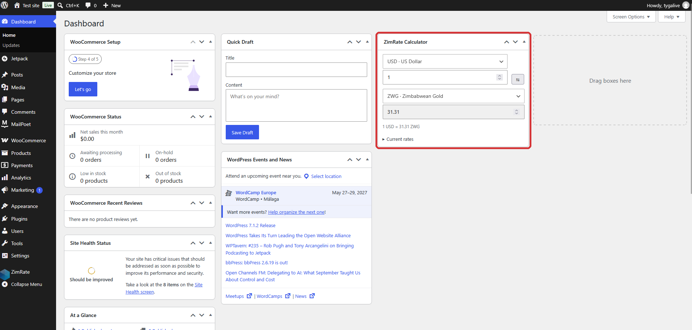
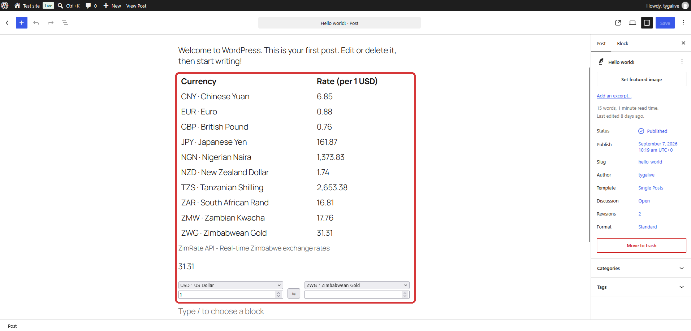
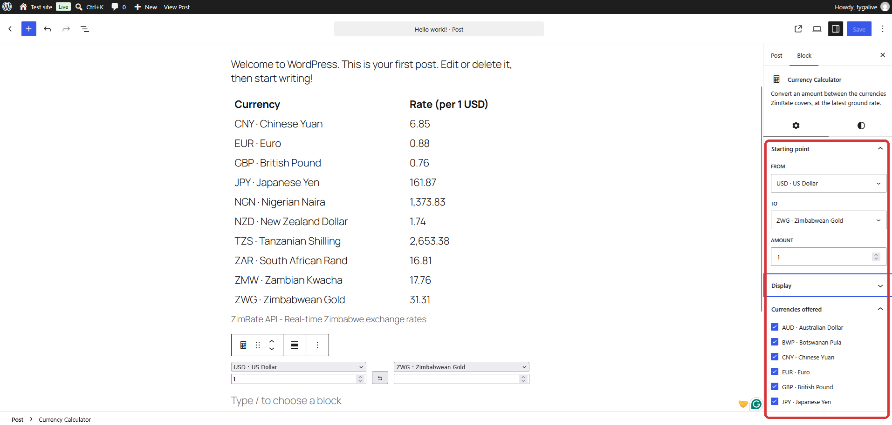
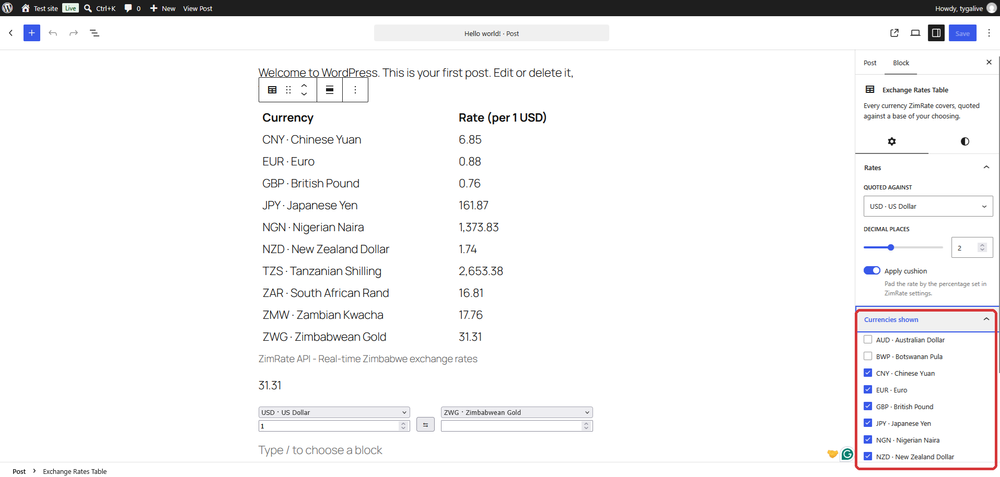
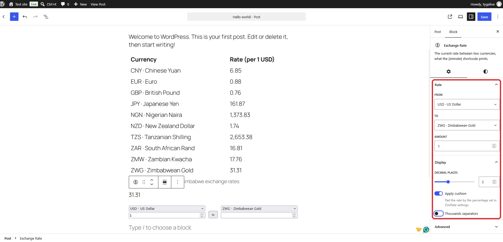
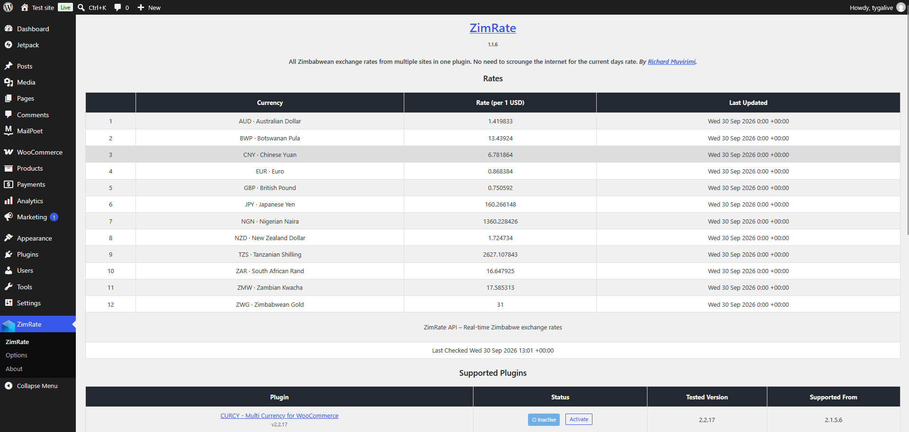

# ZimRate

- **_Contributors:_** @tygalive
- **_Donate link:_** https://buymeacoffee.com/fpjyrXk
- **_Tags:_** zimbabwe, zimrate, currency, rate, tyganeutronics
- **_Requires at least:_** 4.0.0
- **_Tested up to:_** 7.1
- **_Requires PHP:_** 7.3
- **_Stable tag:_** 1.1.8
- **_License:_** GPLv2 or later
- **_License URI:_** http://www.gnu.org/licenses/gpl-2.0.html

Exchange rates as they stand on the ground in Zimbabwe, for every currency. No need to scrounge the internet for the current days rate.

### Description

Add automatic currency conversion to your site, at the rates on the ground rather than the official ones.
This plugin modifies the result from listed plugins api calls before they are submitted to plugin.

This plugin directly supports these plugins:

- [CURCY – Multi Currency for WooCommerce](https://wordpress.org/plugins/woo-multi-currency "CURCY – Multi Currency for WooCommerce")
- [Multi Currency For WooCommerce](https://wordpress.org/plugins/wc-multi-currency "Multi Currency For WooCommerce")
- [CurrencyConverter](https://wordpress.org/plugins/currencyconverter "CurrencyConverter")
- [Currency Switcher for WooCommerce](https://wordpress.org/plugins/currency-switcher-woocommerce "Currency Switcher for WooCommerce")
- [Currency Exchange for WooCommerce](https://wordpress.org/plugins/currency-exchange-for-woocommerce "Currency Exchange for WooCommerce")
- [FOX – Currency Switcher Professional for WooCommerce](https://wordpress.org/plugins/woocommerce-currency-switcher "FOX – Currency Switcher Professional for WooCommerce")

All rates are obtained from [ZimRate](http://zimrate.tyganeutronics.com "Zimrate") in one request, whatever currencies you end up showing, and are cached for a refresh interval of your choosing to avoid overloading the server.

This plugin also provides a short code which you can use to display latest exchange rates without updating your posts to ever changing exchange rates.

For the block editor there are three blocks: an exchange rate (the shortcode's equivalent), a currency calculator, and a table of every rate against a base of your choosing. The same calculator and table sit on the WordPress dashboard.

Note: This plugin is not directly a currency switcher (as that would be redundant considering the number of options on wordpress.org).

### Third Party Services

This plugin uses a few third party services to convert currencies originally not supported by [ZimRate](http://zimrate.tyganeutronics.com "ZimRate") to USD. This is done based on the url requested by supported plugin which may include currencies other than USD. Furthermore to reduce calculation errors (due to exchange rate variance), that supported plugin's api is used to get the related exchange rates as USD. These api calls are not done unless requested by the supported plugin.

Listed below are supported plugins including how the api services they use are used by this plugin as well as their privacy policy and/or terms of service links:

- [CURCY – Multi Currency for WooCommerce](https://wordpress.org/plugins/woo-multi-currency "CURCY – Multi Currency for WooCommerce")
  - [villatheme.com](https://villatheme.com/ "villatheme.com") [Privacy Policy](https://villatheme.com/privacy-policy/ "Privacy Policy")
  - When plugin requests for rates from above api, this plugin modifies the returned exchange rates to include the Zimbabwean currency and may go on to do another request to get the rate for requested currencies against the USD.
- [Multi Currency For WooCommerce](https://wordpress.org/plugins/wc-multi-currency "Multi Currency For WooCommerce")
  - [alphavantage.co](https://www.alphavantage.co "alphavantage.co") [Support](https://www.alphavantage.co/support/#support "Support")
  - When plugin requests for rates from above api, this plugin modifies the returned exchange rates to include the Zimbabwean currency and may go on to do another request to get the rate for requested currencies against the USD.
- [CurrencyConverter](https://wordpress.org/plugins/currencyconverter "CurrencyConverter")
  - [exchangerate.guru](https://exchangerate.guru/ "exchangerate.guru") [Privacy Policy](https://exchangerate.guru/privacy-policy/ "Privacy Policy")
  - When plugin requests for rates from above api, this plugin modifies the returned exchange rates to include the Zimbabwean Currency. The exchange rates are already rated against the USD so no further api call are done.
- [Currency Switcher for WooCommerce](https://wordpress.org/plugins/currency-switcher-woocommerce "Currency Switcher for WooCommerce")
  - Provides a filter to directly modify the returned exchange rates, though this plugin will use some of it's internal functions to get requested exchange rate in relation to USD.
- [Currency Exchange for WooCommerce](https://wordpress.org/plugins/currency-exchange-for-woocommerce "Currency Exchange for WooCommerce")
  - Provides a filter to directly modify the returned exchange rates.
- [FOX – Currency Switcher Professional for WooCommerce](https://wordpress.org/plugins/woocommerce-currency-switcher "FOX – Currency Switcher Professional for WooCommerce")
  - Provides a filter to directly modify the returned exchange rates, though this plugin will use some of it's internal functions to get requested exchange rate in relation to USD.

### Installation

##### Automatic installation

Automatic installation is the easiest option -- WordPress will handle the file transfer, and you won’t need to leave your web browser. To do an automatic install of ZimRate, log in to your WordPress dashboard, navigate to the Plugins menu, and click “Add New.”

In the search field type “ZimRate”, then click “Search Plugins.” Once you’ve found us, you can view details about it such as the point release, rating, and description. Most importantly of course, you can install it by! Clicking “Install Now,” and WordPress will take it from there.

##### Manual installation

1. Upload `/zimrate/` to the `/wp-content/plugins/` directory
2. Activate the plugin through the 'Plugins' menu in WordPress

### Frequently Asked Questions

##### What's this?

A currency injector for wordpress plugins. When said plugin requests for latest currency rates using wordpress' functions, this plugin modifies the result before it is submitted to the requesting plugin.

##### Which currencies can i use?

Whatever [ZimRate](http://zimrate.tyganeutronics.com "Zimrate") covers. They are read from the api rather than kept in the plugin, so a currency added there needs no update here.

##### Where's my favourate plugin?

Though have tried to cover as many plugins as possible, there is a limitation on the plugins that can be directly supported.
This plugin relies on a plugin using wordpress' internal http_request feature which has hooks to modify the result or if said plugin has hooks to modify result before use.
If you have a plugin that you want added, you are free to contact.

##### What if i need feature X?

You are free to contact and will happily add feature X as long as it is in the scope of the plugin.

##### Easy Digital Downloads is not supported?

Though would have wanted to supported Easy Digital Downloads, could not get hold of a currency convertor for it.

### Screenshots

#### 1. The ZimRate calculator on your WordPress dashboard

#### 2. The blocks in a post, a rates table, a rate and a calculator

#### 3. The Currency Calculator block, choosing the currencies it offers

#### 4. The Exchange Rates Table block, choosing the currencies it shows

#### 5. The Exchange Rate block, the short code with a sidebar

#### 6. Every rate ZimRate covers, on the plugins own screen

#### 7. Supported plugins and the [zimrate] short code

![Supported plugins and the [zimrate] short code](.github/screenshots/screenshot-7.png)

### Changelog

##### 1.1.8

- Currency flags beside each currency in the rates tables, on the dashboard and in the blocks
- Flags in the block settings too, on the currency dropdowns and the currencies to offer
- The calculator block takes the theme's typography and button style
- Currencies are left aligned on the rates screen

##### 1.1.7

- Rewrote the description for what the plugin does now, rates on the ground for every currency it covers
- New screenshots for the blocks, the dashboard calculator and the rates screen
- A new banner, and the plugin assets are updated with each release from now on

##### 1.1.6

- Moved to the ZimRate GraphQL api, with every rate fetched in one request
- Currencies are no longer fixed to Zimbabwe, whatever the api covers is offered
- Added exchange rate, calculator and rates table blocks for the editor
- Added a calculator and rates table to the WordPress dashboard
- Rates are worked out in decimal where bcmath is available, matching the api
- Currencies are labelled by name, from the site's own locale
- Removed the rate source, currency and base settings, these are now per use

##### 1.1.5

- Minor bug fixes

##### 1.1.4

- Updated plugin integrations with latest API support
- Fixed ISO code checks and conversion logic
- Improved code organization with pure inheritance architecture
- Updated WordPress compatibility to 6.9
- Updated tested versions for all supported plugins
- Corrected plugin names from WordPress.org

##### 1.1.3

- Minor Bug Fixes

##### 1.1.0 - 1.1.2

- add WOOCS - WooCommerce Currency Switcher support

##### 1.0.0

- Initial Release.

### Upgrade Notice

##### 1.1.6

- The rate source, currency and base settings are gone, each is now chosen where it is used. Rates now come from the ZimRate GraphQL api.

##### 1.1.1

- add WOOCS - WooCommerce Currency Switcher support
